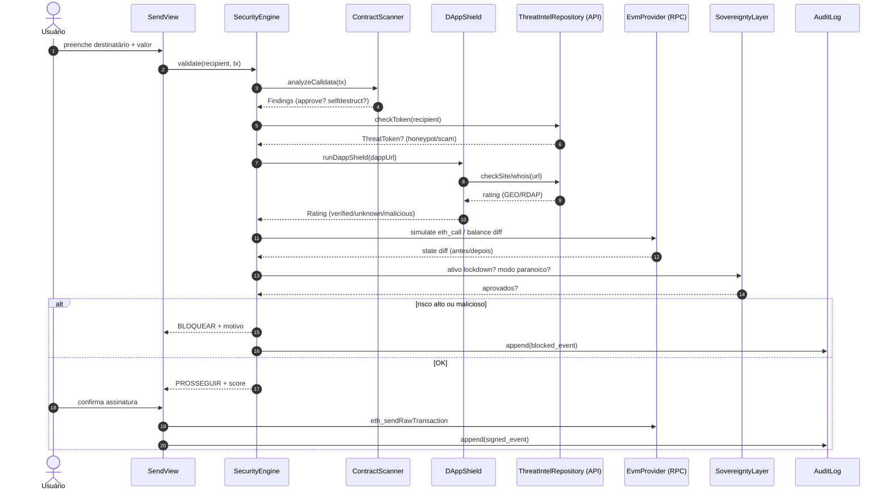
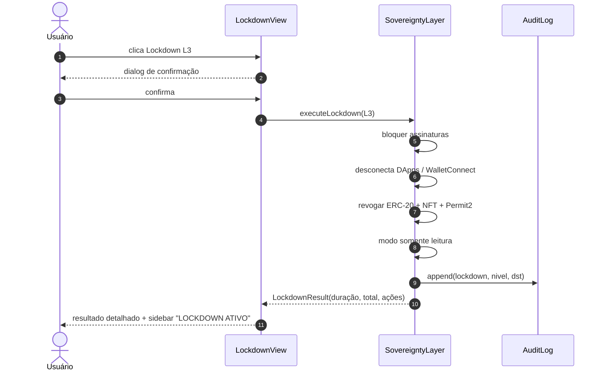

# TANK Wallet — UML (Classe e Sequência)

> Fonte da verdade: `ARCHITECTURE.md` + `src/lib/wallet-*`. Renderizado em Mermaid (GitHub).

## 1. Diagrama de Classes

```mermaid
classDiagram
    direction LR

    class Wallet {
        +string policyId
        +string address
        +PlanTier plan
        +string mnemonic
        +create() Wallet
        +sign(transaction) Transaction
        +unlock(password) bool
    }
    class VaultStorage {
        +encrypt(vault) string
        +decrypt(cipher) Vault
        +persist()
        -PBKDF2_SHA256_250k
        -AES_256_GCM
    }
    class CryptoPrimitives {
        <<utility>>
        +bip39(mnemonic) Key
        +bip32(key) HD
        +bip44(path) Address
        +slip10(ed25519) PubKey
    }

    class SecurityEngine {
        +score 0-100
        +scan(...) RiskResult
    }
    class ContractScanner {
        +scanContract(chain, addr) Score
        +analyzeCalldata(cd) Findings
    }
    class DAppShield {
        +runDappShield(url, blocked) Rating
        -checkBlocklist
        -checkTyposquat
        -checkWhois
        -checkTLD
    }
    class ThreatIntelRepository {
        +findByChainAddress(chain, addr) ThreatToken
        +findSite(url) ThreatSite
        +findAddress(chain, addr) ThreatAddress
        +findExploit(proto) ThreatExploit
    }

    class SovereigntyLayer {
        +readErc20Approvals(...) List
        +readNftApprovals(...) List
        +revokeAll()
        +executeLockdown(level) LockdownResult
    }
    class PermissionManager {
        +grant()
        +revoke(spender)
        +auditLog() PermissionAuditLog
    }
    class BehaviorEngine {
        +learn(profile) BehaviorProfile
        +detectAnomaly(action) Anomaly
    }

    class RiskCenter {
        +aggregate() Score
        +alerts() List
    }
    class PlanGate {
        +filterEngines(tier) Engines
        +isFeatureAllowed(feature, tier) bool
    }
    class AuditLog {
        +append(event)
        -append-only
    }

    Wallet --> VaultStorage : stores
    Wallet --> CryptoPrimitives : uses
    Wallet --> SovereigntyLayer : owns
    SecurityEngine --> ContractScanner
    SecurityEngine --> DAppShield
    DAppShield --> ThreatIntelRepository
    ContractScanner --> ThreatIntelRepository
    SovereigntyLayer --> PermissionManager
    PermissionManager --> AuditLog : writes
    BehaviorEngine --> ThreatIntelRepository
    RiskCenter --> SecurityEngine
    RiskCenter --> BehaviorEngine
    PlanGate --> Wallet : gates

    class ThreatToken { +string chain } +string address } +int severity }
    class ThreatSite { +string url } +int severity }
    class ThreatAddress { +string chain } +string address } +int severity }
    class ThreatExploit { +string protocol } +int lossUsd }
    class PermissionAuditLog { +string action } +string wallet }
    class BehaviorProfile { +string wallet } +string profile }
    class BehaviorAnomaly { +string wallet } +int score }

    ThreatIntelRepository "1" --> "many" ThreatToken
    ThreatIntelRepository "1" --> "many" ThreatSite
    ThreatIntelRepository "1" --> "many" ThreatAddress
    ThreatIntelRepository "1" --> "many" ThreatExploit
    BehaviorEngine "1" --> "1" BehaviorProfile
    BehaviorEngine "1" --> "many" BehaviorAnomaly
```

Legenda: `SecurityEngine`, `ContractScanner` e `DAppShield` formam o pipeline **"antes da assinatura"**. `ThreatIntelRepository` persiste em Prisma/SQLite (models `Threat*`). `SovereigntyLayer` + `PermissionManager` formam a camada de revogação. `PlanGate` aplica feature flags por tier.

## 2. Diagrama de Sequência — Fluxo "Enviar" protegido



## 3. Diagrama de Sequência — Lockdown



## 4. Notação / regra de manutenção

- Atualizar estes diagramas **no mesmo PR** que modificar os módulos mapeados.
- Novo engine/`wallet-*` ou model Prisma → refletir aqui.
- Idioma: nomes de classes em inglês (código), descrições em pt-BR (docs).
